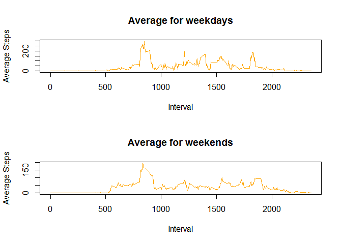

To analyse personal movement data
---------------------------------

It is now possible to collect a large amount of data about personal
movement using activity monitoring devices such as a Fitbit, Nike
Fuelband, or Jawbone Up. These type of devices are part of the
"quantified self" movement - a group of enthusiasts who take
measurements about themselves regularly to improve their health, to find
patterns in their behavior, or because they are tech geeks. But these
data remain under-utilized both because the raw data are hard to obtain
and there is a lack of statistical methods and software for processing
and interpreting the data.

    activity<-read.csv("activity.csv")
    head(activity)

    ##   steps       date interval
    ## 1    NA 2012-10-01        0
    ## 2    NA 2012-10-01        5
    ## 3    NA 2012-10-01       10
    ## 4    NA 2012-10-01       15
    ## 5    NA 2012-10-01       20
    ## 6    NA 2012-10-01       25

    summary(activity$steps)

    ##    Min. 1st Qu.  Median    Mean 3rd Qu.    Max.    NA's 
    ##    0.00    0.00    0.00   37.38   12.00  806.00    2304

    activity$date<-as.Date(activity$date,"%Y-%m-%d")

Total steps every day
---------------------

You can also embed plots, for example:

    steps<-with(activity,tapply(steps,date,sum, na.rm=T))
    hist(steps, xlab= "Total Steps", main= " Total Steps Taken Every Day", col= "steel blue")

    mean0<-round(mean(steps))
    median0<-median(steps)

The median of total steps taken in a day is 10395, mean is 9354.

Variation observed in different intervals
-----------------------------------------

    intervalsteps<-aggregate(steps~interval, activity, FUN = mean)
    plot(intervalsteps$interval, intervalsteps$steps, type="l", xlab= "Intervals",ylab="Average Steps",main="Average steps per interval",col="orange")

    max<-subset(intervalsteps, intervalsteps$steps==max(intervalsteps$steps))
    maximum<-max$steps
    maxinterval<- max$interval

The interval with maximum number of steps is 835.

    nNA<-sum(is.na(activity$steps))

The number of NAs in the data set is 2304.

### To impute NAs

    toclean<-merge(activity,intervalsteps, by= "interval")
    toclean<-toclean[order(toclean$date),]
    names(toclean)<-c("interval", "steps", "date","meanin" )
    i<-0
    while(i<nrow(toclean)){
      i<-i+1
      if(is.na(toclean$steps[i])){
        toclean$steps[i]<-toclean$meanin[i]
      }
    }
    activityclean<-toclean
    rm(toclean)

Total steps every day for imputed dataset
-----------------------------------------

    steps2<-with(activityclean,tapply(steps,date,sum, na.rm=T))
    hist(steps2, xlab= "Total Steps- imputed", main= " Total Steps Taken Every Day-imputed", col= "steel blue")

    mean2<-round(mean(steps))
    median2<-median(steps)
    changemean<-((mean2-mean0)/mean0)*100
    changemedian<-((median2-median0)/median0)*100

The median of total steps taken in a day is 10395, mean is 9354. %change
in median is 0 and %change in mean is 0. \#\# variation between weekdays
and weekends

    activityclean$day<-strftime(activityclean$date, "%A")
    i<-0
    while(i<nrow(activityclean)){
      i<-i+1
      if(activityclean$day[i] =="Monday"){
        activityclean$type[i]<-"Weekday"
      }
      if(activityclean$day[i] =="Tuesday"){
        activityclean$type[i]<-"Weekday"
      }
      if(activityclean$day[i] =="Wednesday"){
        activityclean$type[i]<-"Weekday"
      }
      if(activityclean$day[i] =="Thursday"){
        activityclean$type[i] <-"Weekday"
      }
      if(activityclean$day[i] =="Friday"){
        activityclean$type[i]<-"Weekday"
      }
      else{
        activityclean$type[i] <- "Weekend"
      }
    }
    weekday<-subset(activityclean,activityclean$type == "Weekday")
    weekend<-subset(activityclean,activityclean$type == "Weekend")
    weekdayaverage<-aggregate(steps~interval, weekday, FUN = mean)
    weekendaverage<-aggregate(steps~interval, weekend, FUN = mean)
    par(mfrow=c(2,1))
    with(weekdayaverage,plot(interval,steps,xlab = "Interval",type="l",col="orange", main =   "Average for weekdays", ylab = "Average Steps"))
    with(weekendaverage,plot(interval,steps,xlab = "Interval",type="l",col="orange",main = "Average for weekends", ylab= "Average Steps"))

